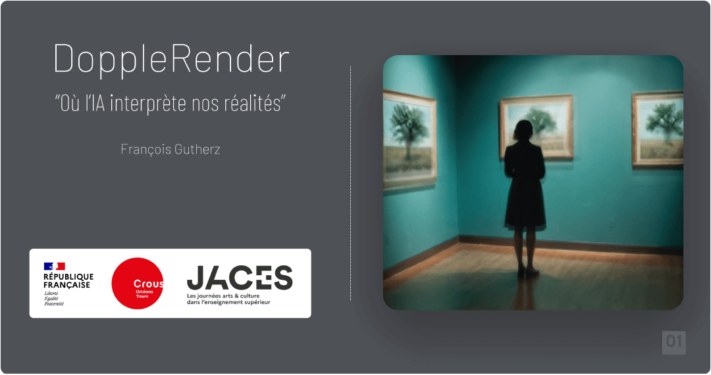

# Latent Space Cadet _navigator_

_aka_ `DoppleRender, the exhibition`

**Latent Space Cadet Navigator** is an interactive art installation developed as a companion to the exhibition *DoppleRender*, where AI interprets and reimagines photographic realities.

This project allows viewers to explore a curated selection of AI-generated visuals created by navigating through the latent space of a generative model. These synthetic images are derived from original photographs and transformed into alternative realities that offer new perspectives on time, space, and visual memory.

## Overview

This is a lightweight interactive kiosk interface, originally designed for an art exhibition shown at CROUS Orléans in March 2025. It runs on any recent Windows-compliant PC and includes:
- Three informative slides about the project (title, context, exploration links)
- A dynamically displayed gallery of generated images
- A section explaining the creation process using latent space traversal (derived from a Miro board)
- Built using [HARFANG](https://github.com/harfang3d/harfang3d) and [Lua](https://lua.org/)

## Exhibition Context

This navigator is part of the *DoppleRender* exhibition. The installation offers a contemplative experience into how artificial intelligence can generate meaningful visual alternatives by exploring a space beyond human perception.

> “Each point in the latent space corresponds to a possible version of an image. When we move through this space, each step slightly alters the image — adding or removing details, changing shapes and colors, shifting its mood or style.”

## Explore

Want to dive deeper?
- [Instagram feed](https://www.instagram.com/latentspacecadet/)
- [BlueSky profile](https://bsky.app/profile/latentspacecadet.bsky.social)
- [GitHub Repo](https://github.com/astrofra/latent-space-cadet-navigator)

## Credits

Created by [François Gutherz](https://github.com/astrofra) 
Part of this project was first presented during [Matricule Bis 2023](https://sites.google.com/view/matricule-bis-2023) 
Supported by [Crous Orléans-Tours](https://www.crous-orleans-tours.fr/) & JACES 2025 
(The system that supports this interactive kiosk is part of a VAE Master Research in Digital Arts - [Paris 8](https://www.ati-paris8.fr/))

